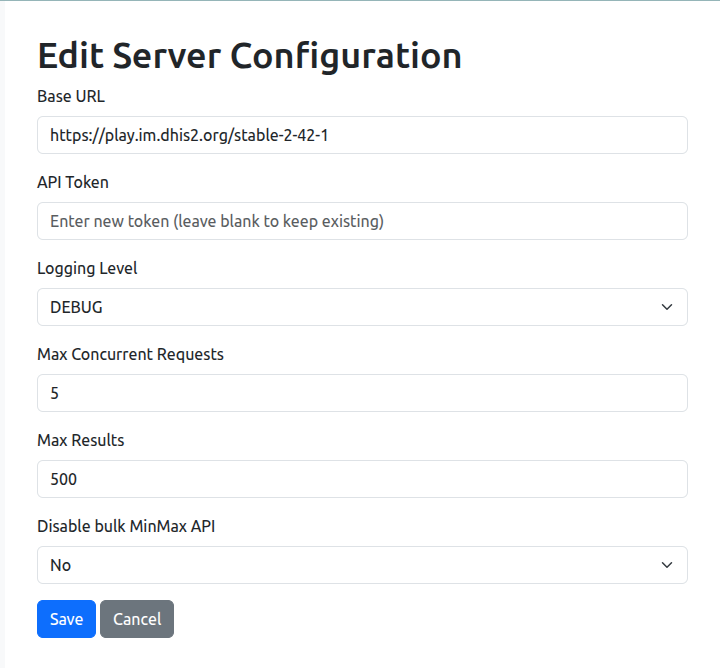

Configuration
============================

Server configuration
----------------------------
The server configuration is specified in a YAML file. A sample configuration file is provided in the `config` directory of the repository. You should copy this file to a directory of your choice and modify it as needed.
Here is an example of the server configuration:

.. code-block:: yaml

   server:
   # replace with your DHIS2 instance URL/No trailing slash
     base_url: https://play.im.dhis2.org/stable-2-42-1 
     d2_token: YOUR_API_TOKEN
     logging_level: INFO            # DEBUG | INFO | WARNING | ERROR
     max_concurrent_requests: 10    # limits simultaneous API calls
     max_results: 1000              # caps results per request (500–50000)
     root_org_unit: ROOT_ORG_UNIT_ID  # optional, e.g. "ImspTQPwCqd"
     default_coc: DEFAULT_COC_ID    # optional, e.g. "HllvX50cXC0"

Maximum concurrent requests
----------------------------------
The `max_concurrent_requests` setting controls the number of simultaneous API calls that the DQ Workbench will make to the DHIS2 instance. 
Increasing this value can speed up processing, but
it may also lead to rate limiting or timeouts if the DHIS2 server cannot handle the load. 
A value between 5 and 10 is generally recommended, but you should adjust this based on your server's capabilities and performance.    

Maximum results per request
----------------------------------
The `max_results` setting determines the maximum number of data quality results which can be returned from the API. In recent versions of 
DHIS2, you can adjust this value between 500 and 50000. In general, if you are using the DQ Workbench to monitor a large number of validation rules or outliers,
you will need to increase this value to ensure that all results are returned. However, setting this value too high may lead to performance issues or timeouts, so it is recommended to start with a lower value and increase it as needed.
Some experimentation may be required to find the optimal value for your specific use case and server configuration. Values of 5000 or 10,000 are often a good starting point.

In order to change  the server configuration, you can make a POST request to the `/api/systemSettings` endpoint with the following JSON payload:

.. code-block:: json
    {
    "maxDataQualityResults": 10000
   }

Setting the root organisation unit
----------------------------------
The `root_org_unit` setting specifies the root organisation unit for the DQ Workbench tool.
This setting is only relevant when your system has multiple top-level organisation units.
If your system has a single top-level organisation unit, you can omit this setting, and the DQ Workbench will automatically use the top-level organisation unit as the root.
However, if your system has multiple top-level organisation units, you must specify one of them as the root organisation unit.

Setting the default category option combo
------------------------------------------

Modern versions of DHIS2 use the same UID (``HllvX50cXC0``) for the default category option combo across all instances.
If your system has a default category option combo with a different UID (or you have multiple default COCs) you must
specify the UID of the default category option combo to use in the `default_coc` setting.
If you do not specify a value for this setting, the DQ Workbench will use the UID ``HllvX50cXC0`` as the default category option combo.

Creating a dedicated user account
----------------------------------

Ideally, you should use a dedicated user account with an API token for authentication which has a limited set of permissions. These permissions include:
 - Add data element groups
 - Add data elements
 - Export metadata
 - Import metadata
 - Add/update min-max data values
 - Add/update data values
 - Run validation
 - Perform maintenance tasks

 Keep in mind that if any of your data sets are restricted by user groups, you will need to ensure that the user account you are using
 for the DQ Workbench tool is a member of those user groups so that ithas access
 to read data from those data sets. The user should also be assigned to the root organisation unit to ensure full access to all data across
 the organisation unit hierarchy.

Once you have created the user account, login with that account and generate an API token. 
This token will be used for authentication when the DQ Workbench tool interacts with the DHIS2 instance.
You will need to grant the copy at least "GET" and "POST" permissions.
You should carefully consider the expiry date for the token. 
It is best security practice to set an expiry date and renew the token before it expires.
However, if you set an expiry date, you will need to remember to update the configuration file with the new token before the old one expires to avoid disruptions in service.

You can generate an API token by navigating to the user profile page in DHIS2 and selecting the "Generate new token" option.
Be sure to keep your browser tab open until you have copied the token, as you will not be able to retrieve it again later.
Once you have copied the token, paste it into the `d2_token` field in your configuration file or enter it in the web UI configuration page.

Sample configuration file (UI view)
----------------------------

