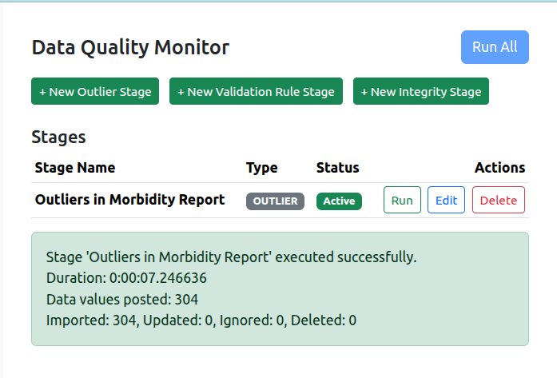
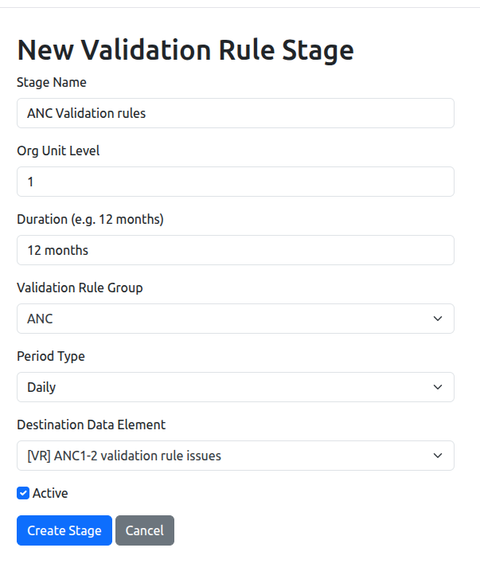
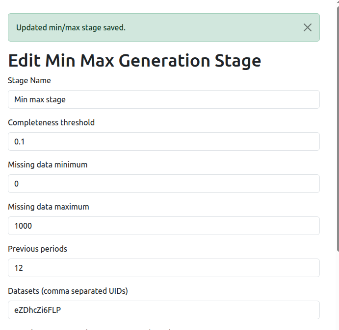
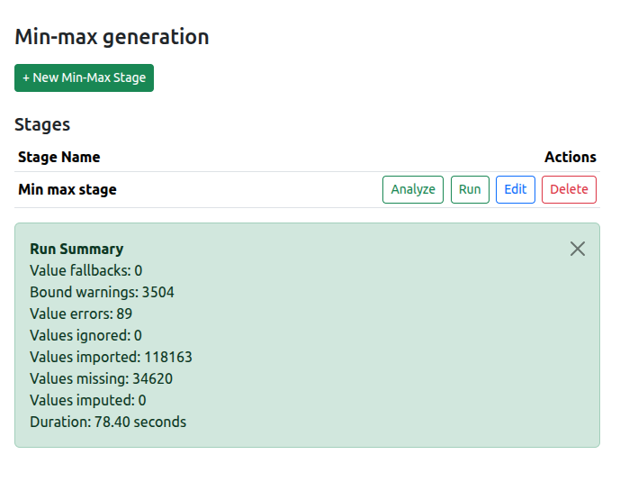

DQ Workbench — Feature highlights
============================================

Motivation
============================
- Store (meta)data quality metrics as DHIS2 values
- Enable tracking of data quality over time
- Facilitate data quality improvement actions
- Extend DHIS2 core capabilities

Overview
========

- Purpose: Monitor and improve data quality in DHIS2
- Outputs: Numeric snapshot values of validation rules, outliers, integrity checks
- Input: DHIS2 data via Web API
- Workflow: Configure stages → run via UI/CLI → analyze in DHIS2

Architecture
============

Layers
------
- Web UI: Configure stages and run jobs
- Analyzer stages: Validation rules, Outliers, Integrity checks
- CLI: Automate daily runs of stages (scheduling with cron/systemd)
- DHIS2 storage: Writes metrics to data elements

Server configuration
============================

Setting up the server
----------------------------
- Supports authentication via API token (only)
- Configurable concurrency. Adjust to fit your DHIS2 server capacity
-  Adjust `max_results` to match your servers `maxDataQualityResults` setting

Server config (UI)
--------------------
.. image:: ../_static/screenshots/server_config.png
   :alt: Server configuration
   :class: r-stretch

Configuration (YAML)
--------------------
.. code-block:: yaml

   server:
     base_url: https://play.im.dhis2.org/stable-2-42-1
     d2_token: YOUR_API_TOKEN
     logging_level: INFO            # DEBUG | INFO | WARNING | ERROR
     max_concurrent_requests: 10    # limits simultaneous API calls
     max_results: 1000              # Should match maxDataQualityResults on DHIS2

Monitoring
===========

Validation Rules
-----------------
- Maps a count of  validation rule violations for selected groups over a time window
- Stores a single value per org unit and period
- Aggregate counts of violations in a validation rule group to a data element

Outliers
----------
- Maps a count of outliers for a given class to a data element
- Multiple methods: Z‑score, Modified Z‑score, Min-max, Invalid numeric
- Configure time window, org unit group, and outlier class

Running an outlier stage
----------------------------

Integrity Checks
----------------
- Maps the count of integrity violations to a data element
- Enables tracking of (meta)data integrity over time
- Support for various period types (Monthly, Weekly, Daily)

Create integrity stage
------------------------

Min-max Generation
==================

Min-max Overview
--------------------
- Generates min-max ranges from historical data
- Utilizes new bulk import API
- Configurable lookback period and org unit group
- Configurable organisation unit levels to optimize data retrieval
- Asynchronous processing for large datasets

Min-max groups
-----------------
- Define groups of data elements for min-max generation
- The `limit median` is used to define the group
- Each group can have its own statistical method and threshold

Min-max configuration
-------------------------

Min-max import
-----------------

Min-max Statistical methods
----------------------------

- Previous max: Uses the maximum value from the lookback period
- Z-score: Mean ± Threshold*stddev from the lookback period
- MAD: Median ± Threshold*MAD from the lookback period

Min-max Statistical methods
-----------------------------
- Box-Cox: Uses Box-Cox transformation for normality, then mean ± Threshold*stddev
- IQR: Q1 - 1.5*IQR to Q3 + 1.5*IQR from the lookback period
- Constant range: User-defined fixed min and max values