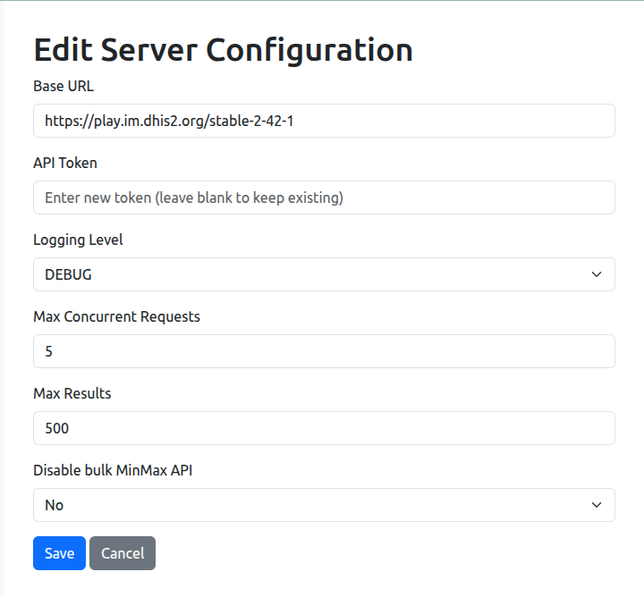
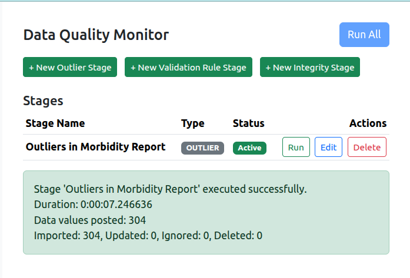
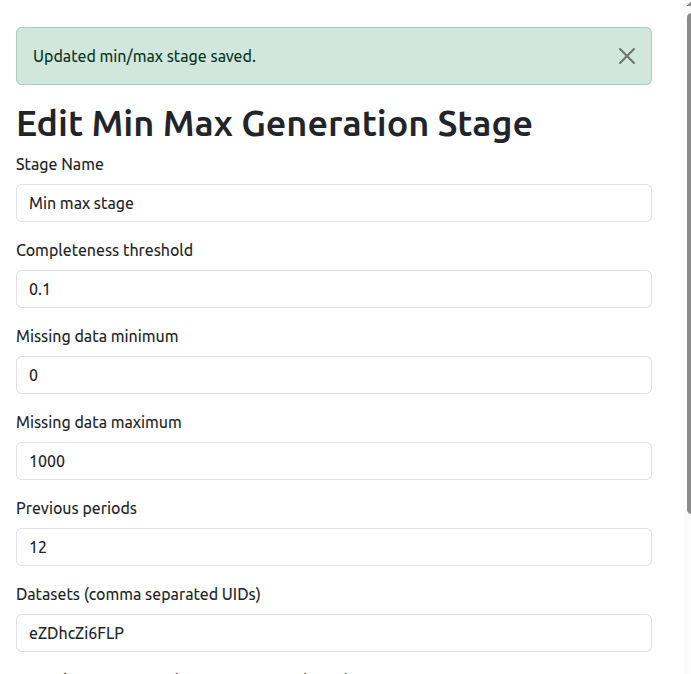
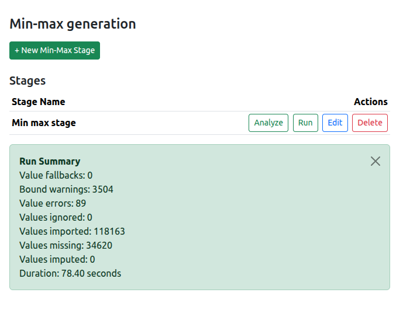

DQ Workbench — Feature highlights
====================================

Motivation
==========
- Store (meta)data quality metrics as DHIS2 values
- Enable tracking of data quality over time
- Facilitate data quality improvement actions
- Extend DHIS2 core capabilities

Overview
========
- Purpose: Monitor and improve data quality in DHIS2
- Outputs: Numeric snapshot values of validation rules, outliers, integrity checks
- Input: DHIS2 data via Web API
- Workflow: Configure stages → run via UI/CLI → analyze in DHIS2

Architecture
============
- Web UI: Configure stages and run jobs
- Analyzer stages: Validation rules, Outliers, Integrity checks
- CLI: Automate daily runs via cron/systemd
- DHIS2 storage: Writes metrics to data elements

Server configuration
====================

Setting up the server
---------------------
- Authentication via API token
- Configurable concurrency — adjust to fit your DHIS2 server capacity
- Adjust ``max_results`` to match your server's ``maxDataQualityResults`` setting

Server config (UI)
------------------

Configuration (YAML)
--------------------
.. code-block:: yaml

   server:
     base_url: https://play.im.dhis2.org/stable-2-42-1
     d2_token: YOUR_API_TOKEN
     logging_level: INFO
     max_concurrent_requests: 10
     max_results: 1000

Monitoring
==========

Validation Rules
----------------
- Maps validation rule violation counts for selected groups over a time window
- Stores a single value per org unit and period
- Aggregates violations in a validation rule group to a data element

Outliers
--------
- Maps a count of outliers for a given class to a data element
- Multiple methods: Z-score, Modified Z-score, Min-max, Invalid numeric
- Configure time window, org unit group, and outlier class

Running an outlier stage
------------------------

Min-max Generation
==================

Min-max Overview
----------------
- Generates min-max ranges from historical data
- Uses the new bulk import API
- Configurable lookback period and org unit group
- Asynchronous processing for large datasets

Min-max groups
--------------
- Define groups of data elements for min-max generation
- The ``limit median`` is used to define the group
- Each group can have its own statistical method and threshold

Min-max configuration
---------------------

Min-max import
--------------

Statistical methods (1)
-----------------------
- Previous max: Maximum value from the lookback period
- Z-score: Mean ± Threshold × stddev
- MAD: Median ± Threshold × MAD

Statistical methods (2)
-----------------------
- Box-Cox: Normalizing transformation, then mean ± Threshold × stddev
- IQR: Q1 − 1.5×IQR to Q3 + 1.5×IQR
- Constant range: User-defined fixed min and max values

Roadmap
=======
- Zero value analysis
- Timeliness and completeness
